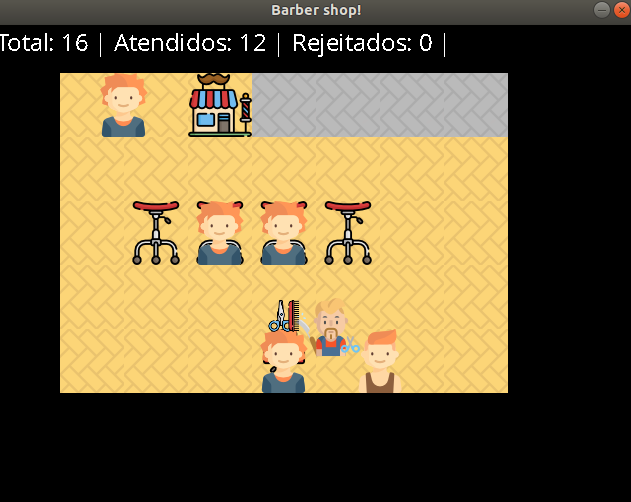

# Trabalho de Sistemas operacionais 1
## Implementando o problema do barbeiro dorminhoco
  

**Grupo:** [Pedro Fontebasso Lemos](https://github.com/Leinvedan) e [Richard Valentim de Souza](https://github.com/Ricsouza2302)

**Bibliotecas necessárias:** SDL2, SDL_image e SDL_ttf

**OBS 1:** As classes responsáveis pela interface foram retiradas e adaptadas (por mim e pelo Richard) de outro projeto pessoal meu. Por isso, podem haver alguns métodos, constantes e/ou variáveis inutilizadas.

**OBS 2:** O código relacionado ao problema do barbeiro, se encontra nos arquivos Salao.cpp e Salao.h. A classe Manager, cuida da renderização das informações fornecidas.

### Referências:

Icones da aplicação:
* Barbeiro e acessórios: https://www.flaticon.com/packs/barber-shop-3
* Clientes: https://www.flaticon.com/packs/kids-avatars